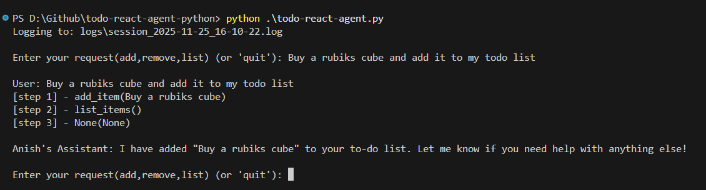
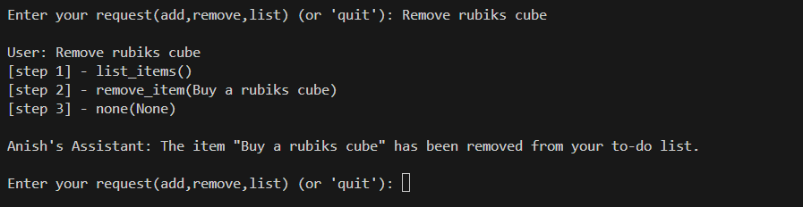
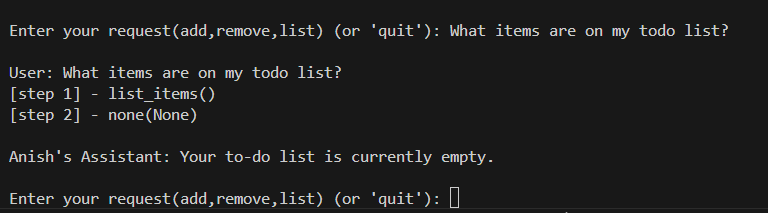

# TODO REACT AGENT PYTHON  - CLI

- My understanding while implmenting this
1. Reasoning(Thought)
2. Acting(calling python function)
3. Observing(result back into the LLM)

- Bascially to avoid hallucination and improve accuracy.

## Setup
- create a .env file with a key

## Usage

```python todo-react-agent.py```

## Example Commands to try
- "Buy a rubiks cube and add it to my todo list"
- "Remove rubiks cube"  
- "buy vegetables and fruits and add to my todo list"
- "What items are on my todo list?"


## Output
Added


Removed 


List all


- I have ignored from gitignore logs/ for you to check. 

